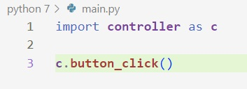
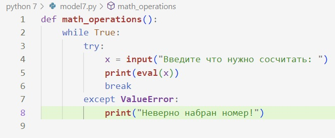
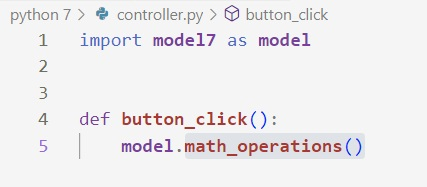

# Архитектура приложения калькулятор.
###Структура
Приложение состоит из трех структур 
-controller
-main
-model7
**Главной структурой является папка main**

с помощью этой папки мы связываем все папки между собой.
В **Папке model7*** находится основной код приложения.

И в папке **controller** является объектом связывающий функции, которые находятся в model7.

